build-lists: true

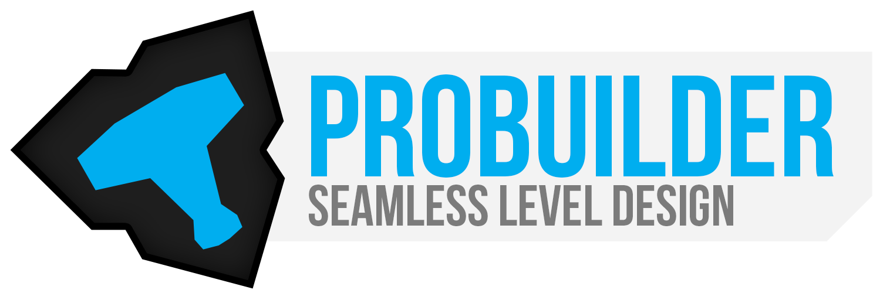

# ( The Post-Mortem )

---

# Project Summary

- What are Unity Plugins / Asset Store?
- What is ProBuilder
- What were it's initial goals
- What were the challenges getting there?
- How did we overcome those challenges?

---

# Project Summary (continued)

- Where is it now
- What are it's future goals
- Lessons learned from pricing

---

# What are Unity Plugins / Asset Store?

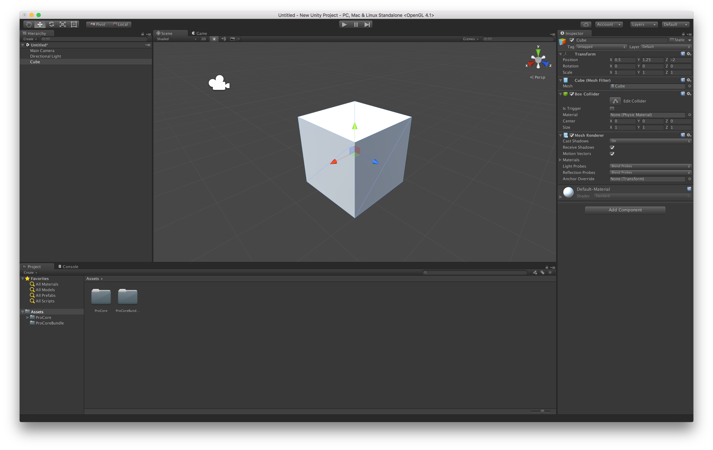

---

# Extensions, Tools, Middleware (etc)

- Plugins are tools built on top of software to add functionality
	- Exporting OBJ files in Maya
	- An image filter in Photoshop
	- A new keyframing tool in video editing software

---

# Unity is built for plugins

- Much of the editor is built with the same API made available to developers
- C# makes for very fast iteration (ie, not re-compiling the editor for every change)
- Excellent documentation

---

# Asset Store

- The asset store is a place to buy and sell plugins (and art)

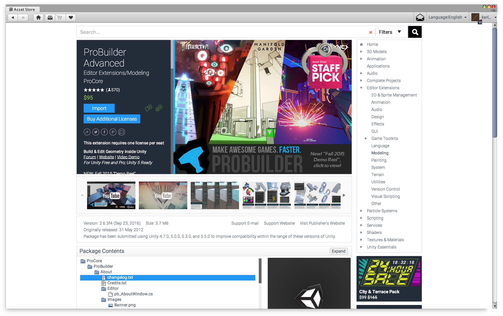

---

# What is ProBuilder?

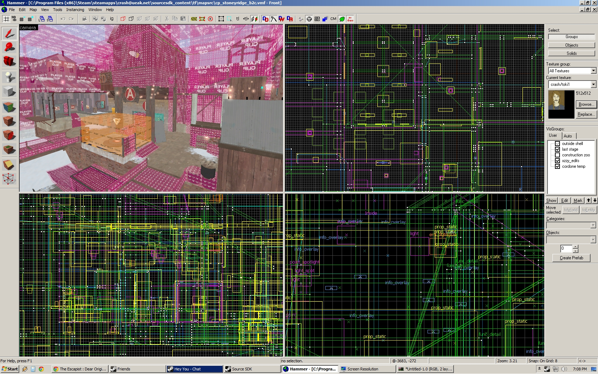

---

# What is ProBuilder?

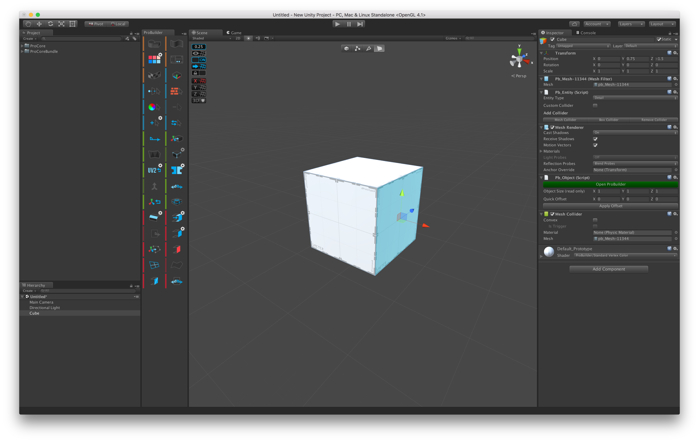

---

# What is ProBuilder?

- 3D Modeling in Unity
- Powerful tools with a newbie friendly approach
- Makes iterating on level designs lightning fast

---


---

# Scope of work

- ProBuilder 1.0:
	- Move faces and vertices
	- Basic texturing (what I was originally brought on to do)
- Feature creep
- ...but in a good way

---

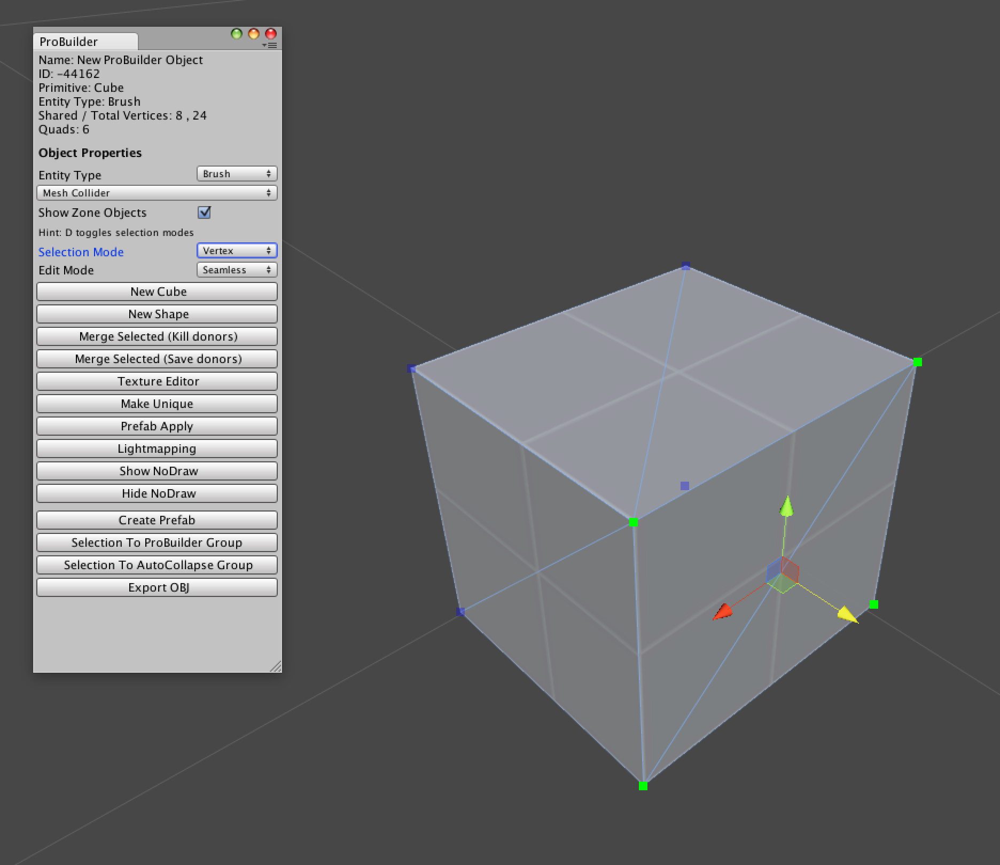

---

# ProBuilder 2.0

- Complete re-write
- Met initial goals, then some
- Overally successful launch
- That sounds great! No problems then?

---

# An Assortment of Challenges

### (The interesting ones)

---

# Long Beta Period

- It took much longer than expected to exit beta stages
- Feature creep was a part of it
- Largely due to desire for backwards compatibility

---

# Backwards Compatibility

- ...is the worst
- Needed to handle
	- ProBuilder 1 scenes
	- Beta 2.x scenes
- Core parts of ProBuilder still constantly changing
- I didn't plan for it well

---

## Problems
- Lots of different versions of ProBuilder (each more incompatible than the last!)

- No standard ProBuilder file format
- Every upgrade was a moving target
- Spent a lot of time writing bridge code

---

## A Moving Target

- Didn't define a file spec early
- Results in incredibly complicated upgrade path
- Instead of cutting losses just tacked on more

---

## What We Did

- Wrote a lot of one-off conversion scripts
- Spent a lot of time on support, often manually upgrading projects for users
- Time consuming and draining
- At some point settled on an installer

---

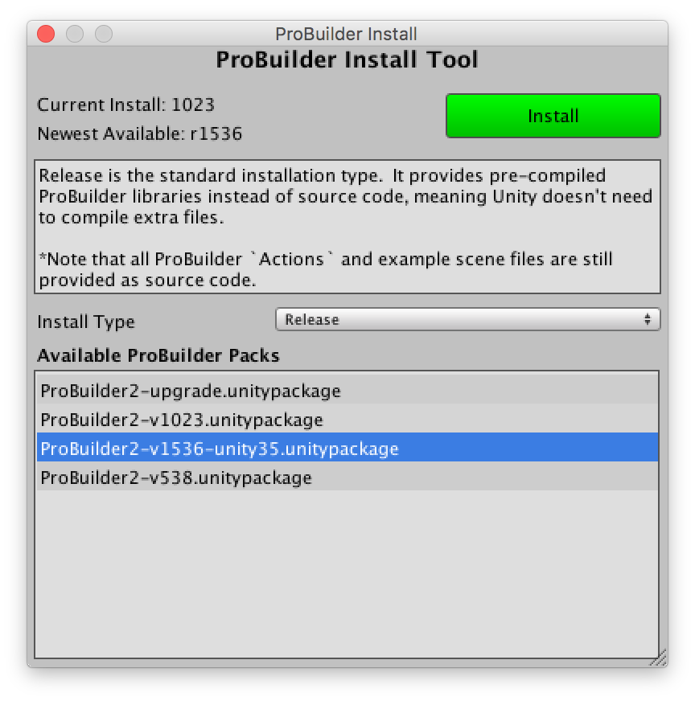

Nice when it worked

---

## The Installer Debacle

- Not in line with Unity workflow
- Super fragile
- Incredibly fragile
- Not user friendly (still required user interaction)
- Complicated packaging & distribution

---

## Installer Wasn't Entirely Bad

- Allowed greater flexibility in changes (could move and delete stuff)*
- Arguably looked more professional than readme with upgrade instructions

*Moving and deleting exposed files wasn't great either

---

## The Solution

- Stop changing the file spec
- Be aware of compatibility breaking changes
- When removing things, mark deprecated instead of deleting

---

# The Interface

- Has seen 3 major iterations
- Many many smaller tweaks

---

## Interface Goals

- Feel native to Unity
- Be functional
- Look pretty

---

## Interface Challenges

- Unity's default interface isn't prettiest [^1]
- Needs to work with both dark and light skins

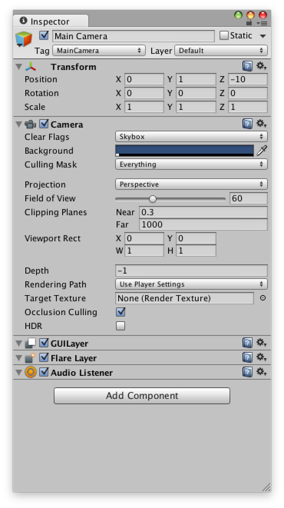

[^1]: In our opinion

---

## Initial Offering

Icons!

- Looked nice
- Not many actions; learning curve was small
- New menu items now required two people

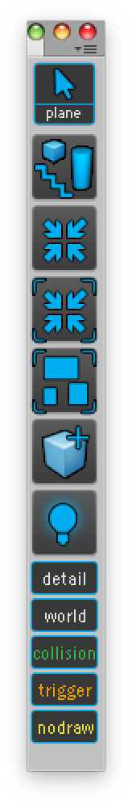

---

## Icons Continued

ProBuilder starts getting more features added.

- Pain to keep up with new menu icons
- Complex mesh operations are hard to represent in 32px
- Users had to memorize large array of icons

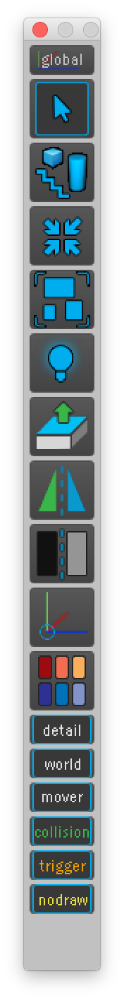

---

## Switch to Text

Too many items overwhelms icon approach, swap to dynamic text-based menu.

- Was easier to handle in code
- Adding new items was fast
- Could hide and show items based on context
- Fit Unity UI (but looked meh)

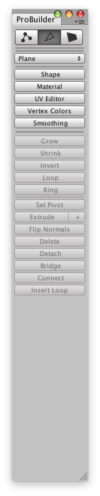

---

## The Great Compromise

Or rather, the lack there-of.

- Option for icon or text based
- Still context based
- Re-written with extensibility in mind

^ Can register delegates for custom items
Don't need icon for a new menu item

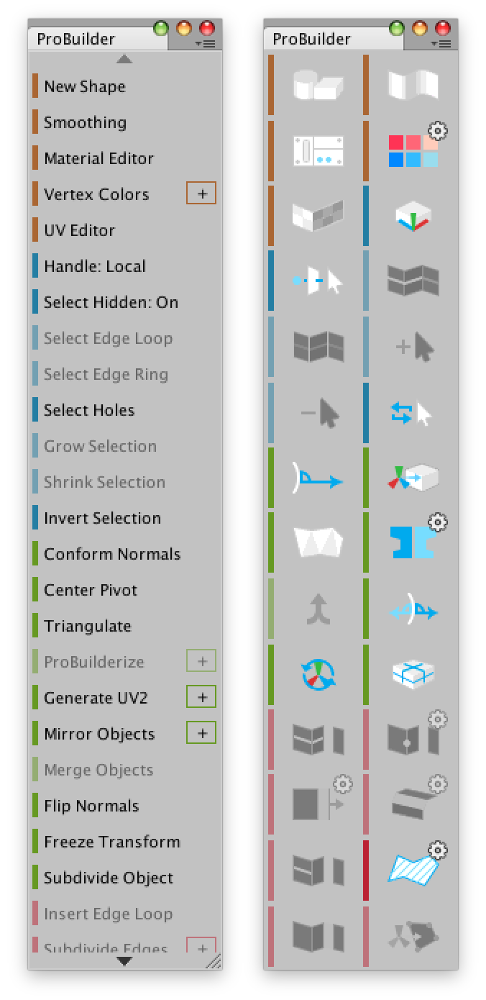

---

## Menu Items Now Generated

Menu bar used to be the wild west - no consistent strategy.

- Menu code generated directly from toolbar source
- Far more flexible, and less chance for inconsistencies

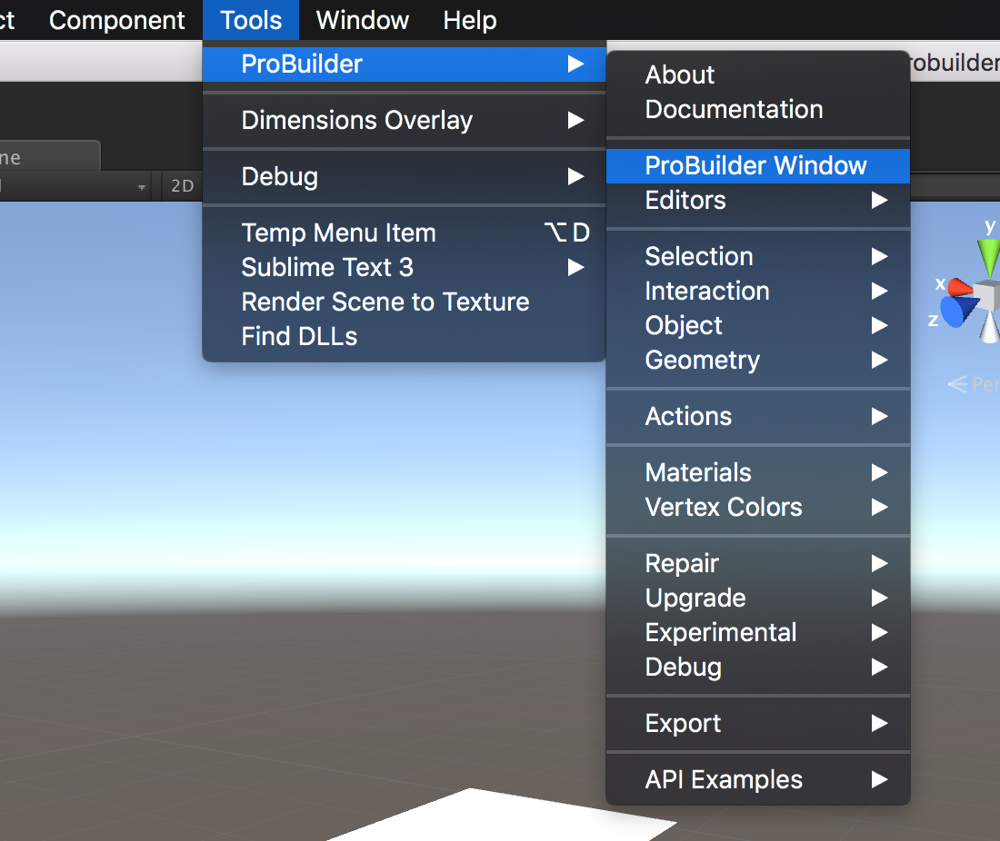

---

# Managing Releases & Patches

- Was using SVN as glorified Dropbox
- No tags/branches for releases
- Patches were few and varying in quality

---

## Managing Releases & Patches

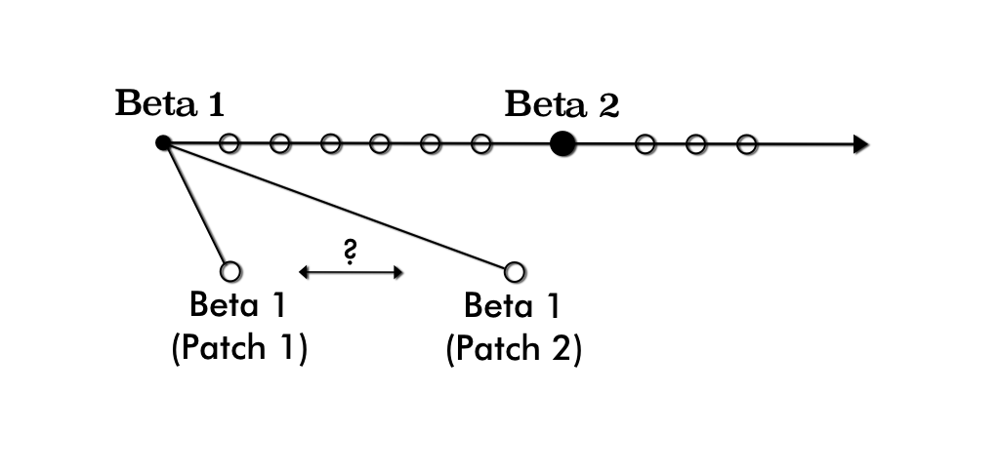

---

## Managing Releases & Patches

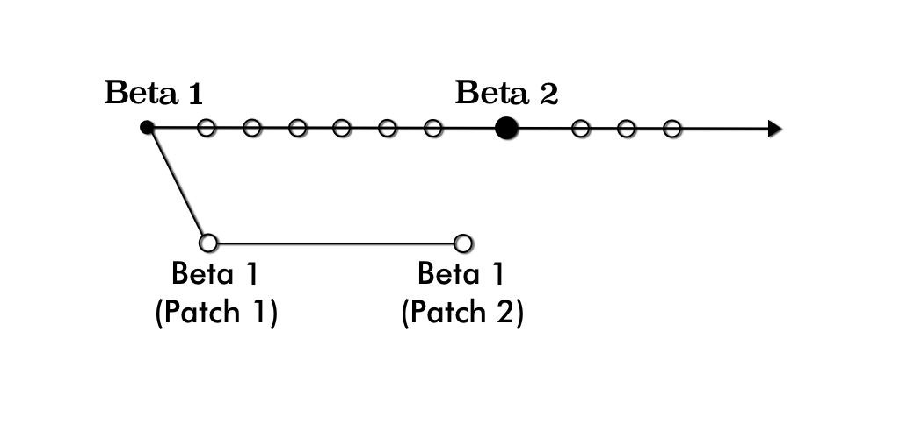

---

## Releases & Patches: The Good

- Kept changelog & and version info up to date
- Maintained `bin/Release` vigilantly (albeit by hand)

---

## Releases & Patches Currently

- Now using git
- Releases are tagged
- New features developed on branches
- Master branch always compiles

---

# Distributing ProBuilder

- We have to support a wide range of Unity versions
- ProBuilder is distributed in DLLs
- Currently we build for 5 separate targets

---

## Building and Packaging

### Initially done by hand

- Tedious
- Error prone
- Did ensure I tested each target

---

## Enter Build Script

The build process is ripe for automation:

- Less room for error
- Significantly reduced build times
- Adding a new build target is trivial

---

## Downsides of Build Script

Not too many to speak of

- High startup cost
- Have to be diligent about human testing

---

# The Mesh Class

## It does way too much

- Currently handles:
	- Storing vertex & triangle data
	- Submesh and material structure layout
	- Normals calculation
	- Element selection
	- Collision volume sizing & placement

---

## Mesh Class

- Makes changes to these methods scary (don't want to break existing models)
- Couples data (vertex positions, triangles, etc) with operations (bad form)
- File size is much bigger than it needs to be (hard to navigate)

---

## Mesh Class Still Does Too Much

- Cost of "just get it working then optimize"
- Still working on paring down the monolith
- Automated tests help with this process

^ What would I do differently

---

# Documentation

---

## A tool with poor (or no) documentation isn't any good

- ProBuilder didn't ship with a manual until sometime last year
- Always had web docs, but they were infrequently updated
- Support forum has been active and monitored regularly

---

## How it used to be

- One gigantic word document
- Then one gigantic markdown document
- Updating was a pain
- Navigation was also a pain

---

## Leveraging static site generators

- Enter [mkdocs](http://www.mkdocs.org/)
- Lets us break monolithic markdown into separate files
- Abstracts web stuff from technical writing
- Easy to update
- Spits out pretty & functional website

---

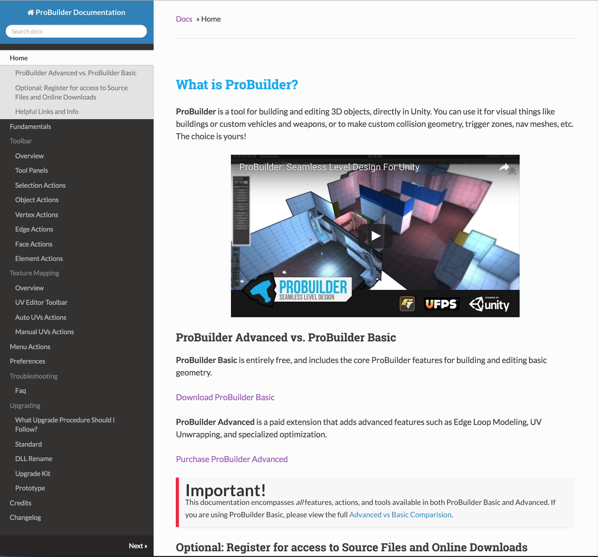

\#fancy

---

## What about a manual?

- Online documentation is great, but we still need to ship with a PDF manual
- Could manage 2 separate documents, but that's error-prone and a pain
- Solution: python script to build PDF from website

---

```python
#!/usr/bin/env python

import os
import pdfkit
import yaml

directory = yaml.load( open("mkdocs-manual.yml") )
pages = directory["pages"]
site_dir = "site"
pdfs = []

# gather all the docs pages in a list of tuples (category, title, path)
print("finding doc pages in mkdocs-manual.yml")

for header in pages:
	for key in header:
		if type(header[key]) is str:
			pdfs.append( ("", key, header[key]) )
		elif type(header[key]) is list:
			for item in header[key]:
				if type(item) == str:
					pdfs.append( ("", key, item) )
				else:
					for kvp in item:
						pdfs.append( (key, kvp, item[kvp]) )

gen_pdfs = []

for page in pdfs:
	if page[1] == "Home" and page[2] == "index.md":
		path = page[2].replace(".md", ".html")
	else:
		split = page[2].split("/")
		path = page[2].replace(".md", "") + "/index.html"

	if len(page[0]) > 0:
		title = page[0] + " - " + page[1] + ".pdf"
	else:
		title = page[1] + ".pdf";

	gen_pdfs.append( site_dir + "/" + path )
	print("processed: " + site_dir + "/" + path)

pdfkit.from_file(gen_pdfs, "manual.pdf", options={
	'disable-javascript':'',
	'quiet': '',
	'load-error-handling': 'ignore',
	'disable-plugins':'' });

print("output pdf to: " + "manual.pdf")
```
---

Took about 2 weeks to solidify documentation build process

Verdict: Absolutely worth the startup cost

---

# Sales & Marketing

---

# Current State

- 6 Different products
- 2 Bundle packages
- 1 free version (ProBuilder Basic)

---

| Product | Cost |
|:-----|:---:|
| ProBuilder Advanced		|	$95.00 		|
| ProBuilder Basic			|	Free  		|
| QuickEdit: Mesh Editor	|	$10.0 		|
| ProGrids 2				|	$20.0 		|
| QuickDecals 2				|	$10.0 		|
| ProGroups					|	$10.00 		|
| ProCore Bundle			|	$150.00 	|
| ProCore Utility Bundle	|	$60.00 		|
| Polybrush					|	$65.00 		|

---

# Questions

- What's the general trend?
- How do discounts affect sales in following months?
- What did ProBuilder Basic do for us?
- What effect did the Bundle have?

----

# Hypotheses

Alt title: Assumptions we made prior to actually analyzing the data

- Sales will negatively affect following months
- A cheap ProBuilder version will sell like hotcakes
- A free ProBuilder version will positively impact Advanced sales
- A Bundle including ProBuilder might negatively affect sales

---

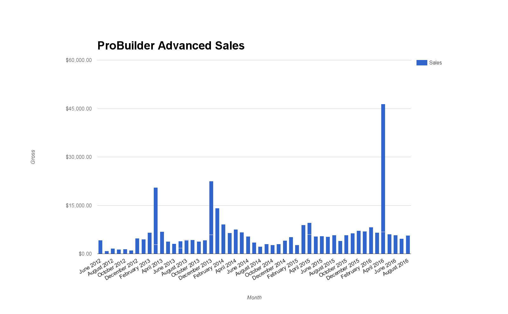

^ Note the spikes

---

# Hypothesis

### Sales will negatively affect following months

---

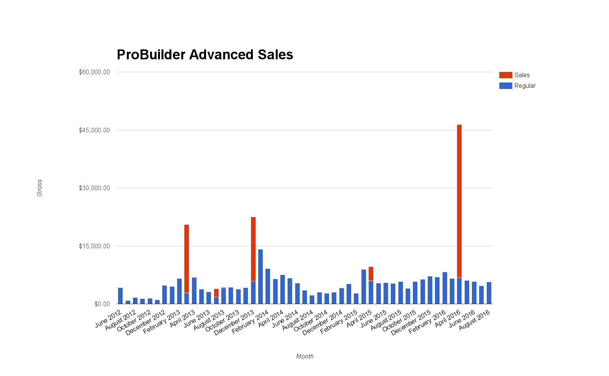

---

# What about sale durations?

---

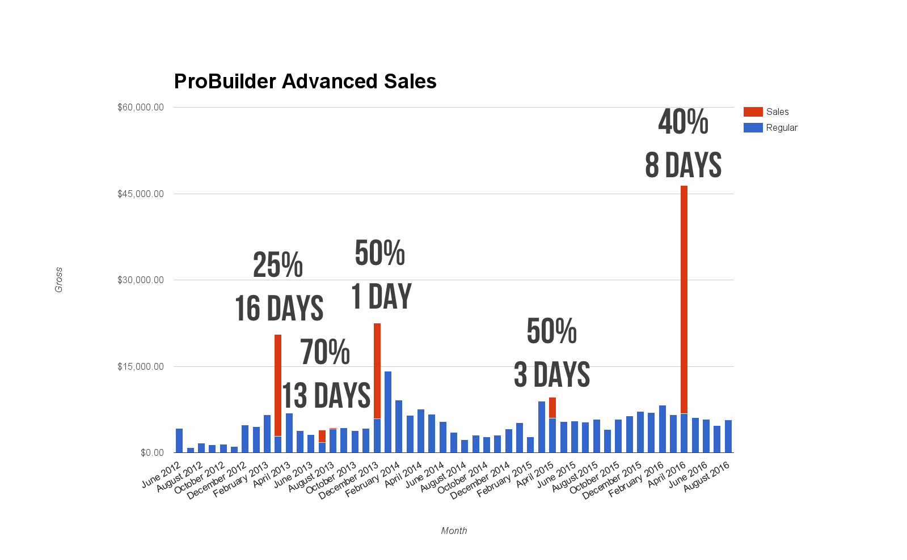

---

# Hypothesis

### Cheaper version of expensive software will be big seller

---

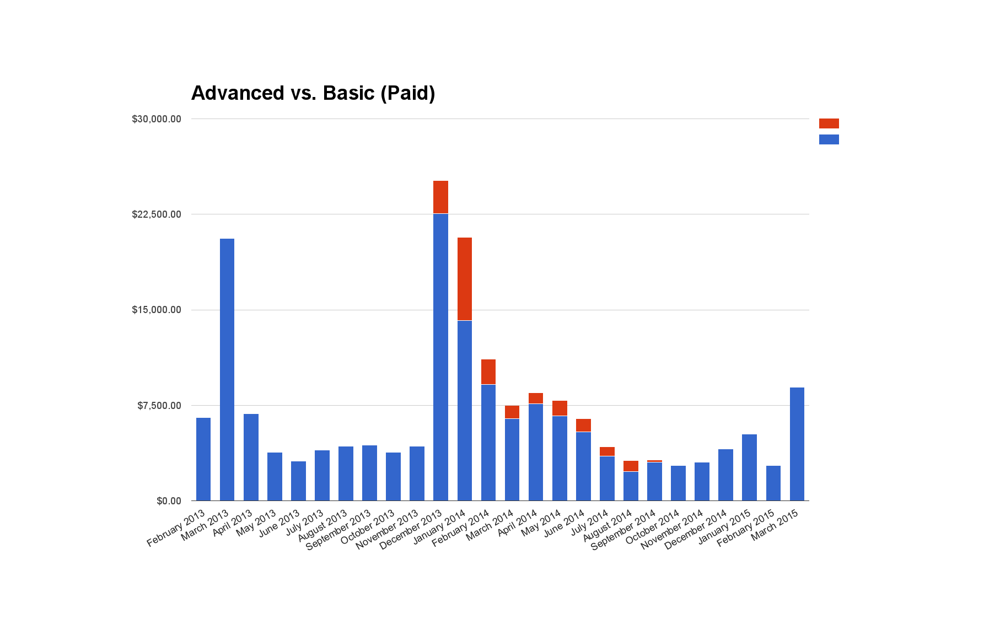

---

# Hypothesis

### Free version of expensive software will increase sales

---

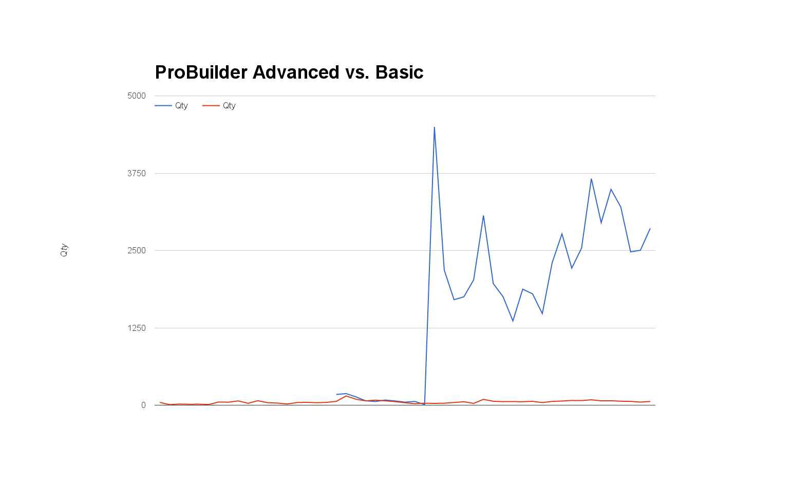

---

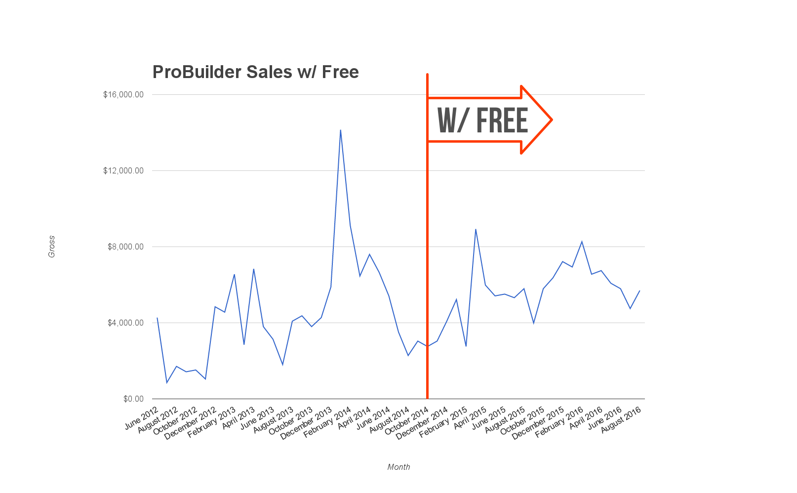

---

# Hypothesis

### Bundle may negatively affect sales

---

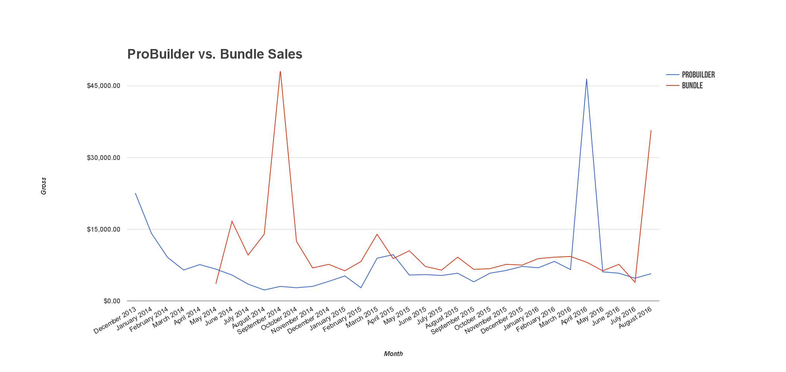

---

# The Future

---

- Plan build and distribution pipeline from start
- Plan for a growing code-base
- Keeping things modular (code & otherwise)
- Focus on large scope expensive (ish)  tools

---

# Questions go here
